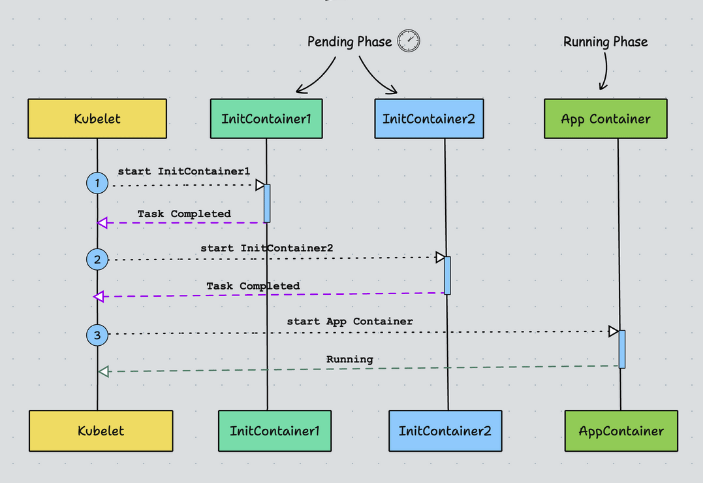

# What is an Init Container?

Kubernetes pods can have more than one container. These containers in a pod work together to achieve a common goal.
Init Containers are containers that start and run to completion before starting the main containers in the pod. It acts as a preparatory step, allowing us to perform initialization tasks, configure prerequisites, or configure dependencies required by the application in the main containers.

# How Init Containers Work?


1. kubelet runs the init containers in the order they appear in the Pod’s spec ensuring that each container completes its task before starting the next. Meaning only one init container runs at a time.
2. Init Containers run before the main application containers start.
3. If the Pod is restarted, all its init containers will run again.
4. In the pods lifecycle, init containers run to completion in the pending phase.
5. Although init containers share the same container specification, they do not support the lifecycle, livenessProbe, readinessProbe, and startupProbe fields. (except for the native sidecar alpha feature)


# Init Container Use Cases

The actual use case of an init container may vary depending on the specific needs of your application. Here are some common use cases:

1. Load and Configure Dependencies:: Init containers can load and configure dependencies needed by the main application container before it starts running.
2. Create Database Schema: You can use the init container to create a database schema.
3. Warm Up Cache: You can warm up a cache using the init container. For example, preloading some frequently used data into the Redis cache.
4. Network Configuration: Init containers can handle tasks such as establishing network configuration or establishing connections to external services.
5. Git Clone: Init containers can clone Git repositories or write files into attached pod volumes.
6. Security Checks: Init containers can perform security checks, such as vulnerability scanning or TLS certificate verification, before starting the main application container.
7. Access to Secrets: Init containers have access to Secrets that application containers cannot, such as retrieving secrets from a vault.
8. Environment Setup:: Init containers can handle tasks such as creating directories, applying permissions, or running custom scripts to set up the environment for the main application.
9. Wait for Services:: Init containers can wait for a service to start before the main application starts.


# Init Container Practical Example


Init containers are defined in the spec.initContainers field of a Pod’s manifest. This is similar to a regular spec.containers definition. We can define as many containers under initContainers section.

1. One init container named write-ip gets the pod IP using the MY_POD_IP env variable populated from the Pod’s own status. and writes to an ip.txt file inside the /web-content volume attached to the pod.
2. The second init container named create-html reads the pod IP from /web-content/ip.txt file that contains the pod IP created by the first init container and writes it to /web-content/index.html file.
3. Now, the main nginx container (web-container) mounts the default /usr/share/nginx/html to /web-content volume where we have the index.html file.

```sh
    kubectl port-forward pod/web-server-pod 8080:80
```

# Adding CPU/Memory Resources

Init containers require CPU and memory resources to run to complete the specific tasks. The limits and requests can be set up based on the criticality of the tasks.

If there are several init containers the highest values set for any init container is called the effective init request/limit. Meaning, that if you have an init container without a CPU/Memory limit set, it can use the maximum of the effective init request/limit.


# Init Container Best Practices
Below are some of the best practices to follow:

1. Ensure init containers are designed to do specific tasks quickly without using too many resources.
2. If you have multiple initialization tasks, use separate init containers for each task. This helps manage and troubleshoot them individually.
3. Init containers can fail, so plan for that. Implement retries, back-off strategies, and clear error messages to diagnose and resolve issues effectively.
4. Take advantage of the pre-run and post-run hooks provided by Kubernetes to run custom scripts or commands during specific phases of a container’s lifecycle.
5. Protect sensitive information used during initialization and avoid disclosure.
6. Make sure the init containers have enough resources allocated. A lack of resources can cause initialization tasks to fail or be delayed.

# Init Container vs Sidecar Container

1. Init Container performs tasks that need to be completed before the main container can start while the Sidecar Container provides supplementary functionality to the main container.
2. Init Container doesn’t share the same network and storage resources as the main container while Sidecar Container shares the same.
3. Init Container executes sequentially and completes before the main container starts. On the other hand, the Sidecar Container starts, runs, and terminates alongside the main container.
4. The Init Container ensures that the main container starts with the necessary prerequisites while the Sidecar Container directly affects the behavior and functionality of the main container.
5. Init Containers can be used to set up the environment for the main application such as downloading configuration files or initializing shared volumes. Sidecar Containers can be used for tasks such as logging data to external systems, collecting metrics, or handling security-related functions.